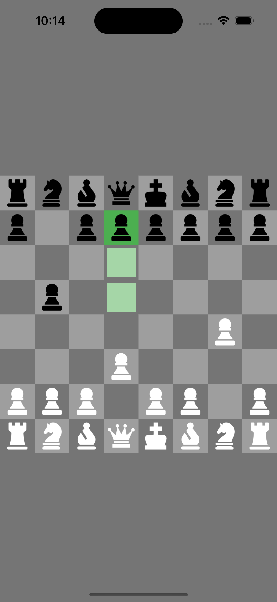

# Chess game using Flutter
Created an Multiplayer Chess game with Minimal UI which can be played offine.

## Setup

Run the following commands from your terminal:

1) `git clone https://github.com/quibler7/Chess-game-using-Flutter` to clone this repository 

2) `flutter pub get` in the project root directory to install all the required dependencies.

## Screenshots 

